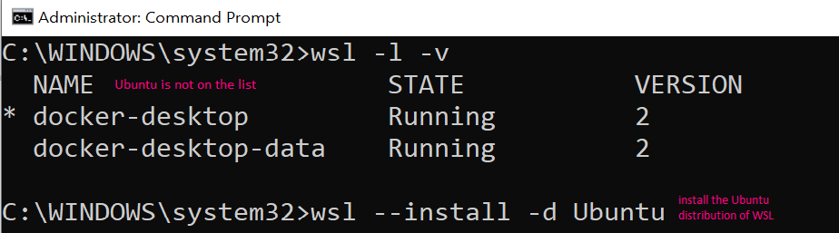

# If WSL is already installed

If after opening the Command Prompt or PowerShell as administrator, and then running `wsl --install`, a help text is shown, it means that you already have some version of WSL installed on your machine. 

<p style="text-align:left;">

</p>

In that case, run the following command to get a list of available distributions (we want the **Ubuntu** one):

```
wsl -l -v
```

## If Ubuntu is already in the list of distributions

<p style="text-align:left;">

</p>

Run 

```
wsl -s Ubuntu
```

to set the default distribution to Ubuntu. 


## If Ubuntu is not yet in the list of distributions

<p style="text-align:left;">

</p>


Run 

```
wsl --install -d Ubuntu
```

to install the Ubuntu distribution, and then 

```
wsl -s Ubuntu
```

to set the default distribution to Ubuntu. 