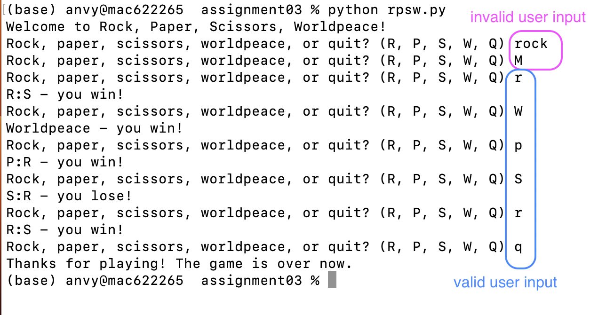

# Assignment 03

for the course [Introduction to Data Science and Programming](https://learnit.itu.dk/course/view.php?id=3022199) (Autumn 2023) at ITU

**Due: October 2, 23:59**

Before you turn this assignment in, make sure to try out your script by running it from the command line interface, and verify that everything runs as expected. Make sure that you have added your name and ITU email address as a comment to the code. **Please submit a Python script named `xxxx_rpsw.py`**, where `xxxx` is replaced by your ITU student ID.

# Rock, Paper, Scissors, Worldpeace: Rules of the game

Write a `.py` script to play Rock, Paper, Scissors, Worldpeace (RPSW) against your computer. 

The rules of Rock, Paper, Scissors, Worldpeace are simple:
* Rock beats Scissors
* Scissors beat Paper
* Paper beats Rock
* Worldpeace beats everything

In each round of RPSW, the user gets asked to choose between Rock (`R`), Paper (`R`), Scissors (`S`), Worldpeace (`W`), or Quitting the game (`Q`). If the user selects `Q`, the game ends. If the user selects `W`, the user always wins. If the user selects `R`, `P`, or `S`, the computer also (randomly) chooses between `R`, `P` and `S`, and the user and computer moves are evaluated against each other: either the user wins; or the computer wins; or it's a tie.

## Instructions for your script

When writing your script, make sure that:
* You print out a welcome message in the very beginning of the game: `Welcome to Rock, Paper, Scissors, Worldpeace!`
* The user is asked for input with the prompt `Rock, paper, scissors, worldpeace, or quit? (R, P, S, W, Q)`
* Accepted user input are the letters, both in lower and upper case: `R`, `P`, `S`, `W`, `Q`, `r`, `p`, `s`, `w`, `q`
* If the user inputs anything but these letters, they get asked for their input again
* As soon as the user provides valid input, one of the following happens:
    * the game ends with the message `Thanks for playing! The game is over now.`
    * the message `Worldpeace - you win!` is printed
    * `X:Y - you lose!` is printed 
    * `X:Y - you win!` is printed
    * `X:Y - it's a tie!` is printed (where X is the user move and Y is the computer move)
* Only the user (not the computer) is allowed to play the "Worldpeace" moves

When ran from the CLI, your program output should look approximately like this:

    

## Code skeleton

We provide a code skeleton `xxxx_rpsw.py`; you are *allowed* to use it, but you don't have to. (There are many possible solutions to this task - the code structure suggested in the code skeleton is only one of many possible ways!)